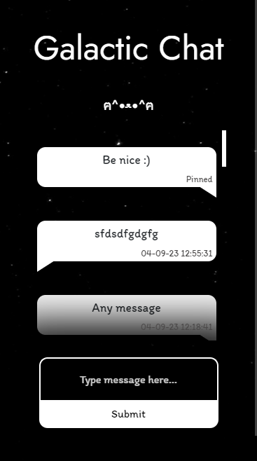

<h1 align="center">Galactic Chat</h1>

  <b>Chat between galaxies ฅ^•ﻌ•^ฅ</b>

## ✨ Features

- Message is stored in MYSQL database
- PHP is used in the backend to process and retrieve messages
- Each message is anonymous
- Each message uses the universal UTC timestamp

## 📋 To-do List

- Display time as _ minutes ago instead of timestamp
- Automatically refresh messages

## 📜 Credits

Everything is coded by Alex lo Storto unless otherwise noted

Licensed under the MIT License.
